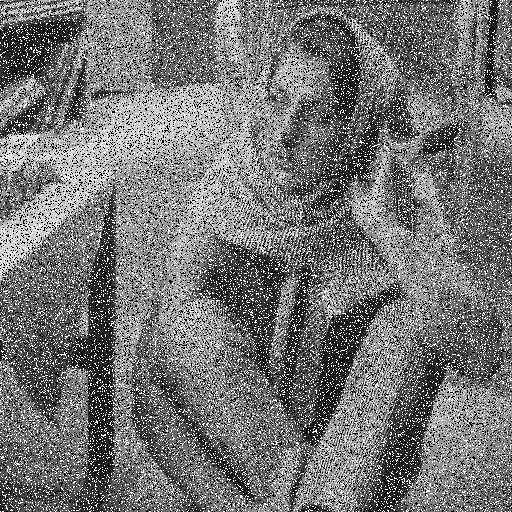
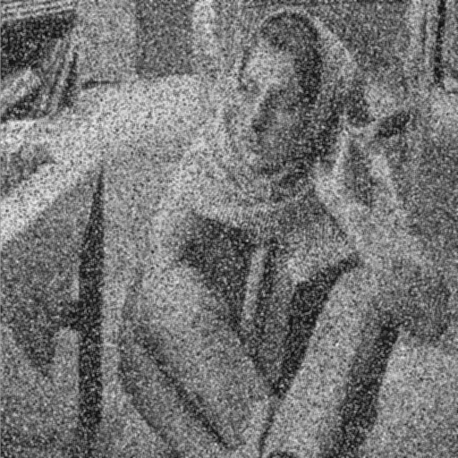

# Suavização de pixeis (smooth) paralelo

Implementação de diversas estratégias de paralelização do algoritmo smooth para suavização de pixeis de forma paralela com _pthreads_.

## Como usar

A imagem precisa ser rgba 512x512

`./execute nome_da_image.rgba`

Para modificar o tamanho da imagem, vá em `smooth.c` e modifique as linhas:

```c
#define WIDTH 512 + 2
#define HEIGHT 512 + 2
```

trocando 512 para o valor desejado. Pode haver problemas se o tamanho não for uma potência de 2.

## Resultados

- sequencial = 17.315 ms
- paralelo (com threadSmoothAlternarLinhas) = 7.590 ms
- paralelo (com threadSmoothBlocosDeLinhas) = 5.845 ms

Dessa forma, o speedup é de (considerando speedup = antes/depois):

- Speedup = 17.315 / 5.845 = 2.96

Ou seja, o paralelismo usando threadSmoothBlocosDeLinhas é quase 3 vezes mais rápido que a implementação sequencial

## Exemplos

### Antes




### Depois



